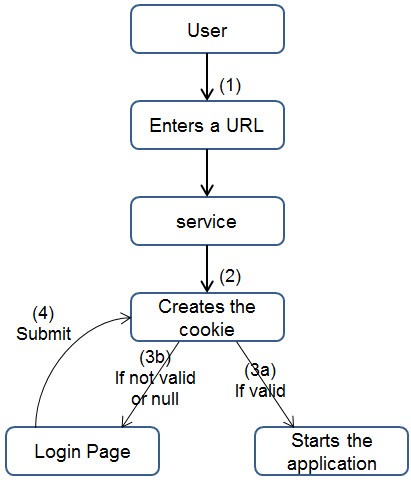

# SimpleSSOProvider demo in depth
## Workflow


## How is managed the authentication ?
When the end user launches the application with this kind of url:
```
http://<gas_server>:<gas_port>/ua/r/ssodemo
```
or
```
http://<gas_server>:<gas_port>/ua/r/ssorelogdemo
```

The start of the application is delegated to the web service.

The HTTP incoming request is now handled by the Genero service. It checks the existence of a valid cookie named **4jsCookie**. If cookie is valid, the Genero REST service returns the HTTP code 307 and the description **_GENERO_INTERNAL\_DELEGATE_** to notify the dispatcher to start the application as response to current user-agent request

If cookie is not present or has expired, the Genero service returns following welcome or expired page to the user-agent :


When the login button is clicked, as it is an XHTML form, all data entered in fields of the form, as well the checking of the box “Would you like to keep password?”, are automatically submitted to the Genero service **Validate** operation. It extracts then the login/password and if they match the database entries, the user-agent is redirected to the initial application after getting the **4jsCookie** authorization set.

### How is the original application URL kept
When the Genero service returns the welcome or expired page, it adds a query string parameter named **back** containing the original URL such as /ua/r/ssodemo, so that when submitting the formular to the Genero **Validate** service, the service retrieves the **back** query parameter and can set the **4jsCookie** path based on it and finally redirect user-agent to that URL.

**Important**: On a production site, you need to use HTTPS in order to encrypt and secure everything, and avoid clear data being sent through the network.

**Important**: The functions included in the sample are examples. On a production site, we recommend you review all functions to match your needs and to avoid data transmitted in clear.

## Add a cookie mechanism
The cookie mechanism allows the browser to permanently keep a trace of a user, eliminating the need to log in when you revisit the application.

### How does the cookie mechanism work?
The cookie is set via the HTTP header “Set-Cookie” and has an expiration date. It requires a name-value pair that can be sent to the browser by a request on the form.
```
CALL req.setResponseCookies(cookies)
```
cookies is a dynamic array containing all the name-value pairs.

Note that the demo sets:
- A expiration date for the cookie (cookie attributes "expires").
- A path for limiting the validity of the cookie to the current application (cookie attribute “path”).
- An opaque cookie value corresponding to a UUID value stored in SQLite database (see sessions table)

The cookie is created when a user is authenticated. The username and password must be correct for a new cookie to be created.

### The cookie structure
The cookie structure is a simple UUID value corresponding to the primary key of the SQLite sessions table, in order to store all information on server database and not provide any **confidential** data on the wire.

### Cookie path
The path for the access cookie named **4jsCookie** is set for the application beeing started in **createSession** function. If you want the SSO to work for all applications of the same gas, you must change the path of that cookie to **/gas/ua/r** instead of **/gas/ua/r/myapp**.

### Cookie expiration date
When the cookie is created, it is handled like this:
- If the “keeping password” box has been checked (password kept), the expiration date is set by default to one day
- If “keeping password” box has not been checked (password not kept), the expiration date is almost instantaneous (10 seconds by default, so that the cookie remains only valid one time for redirection)

It can be easily changed by the constants COOKIE_KEEP (value in days) and COOKIE_VALIDITY (value in seconds) of the SSOService module.
